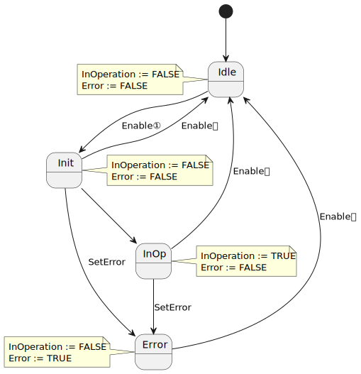
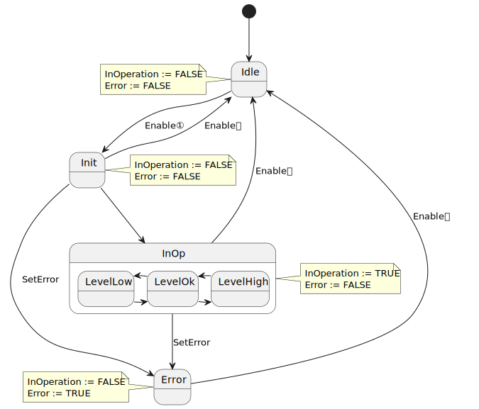
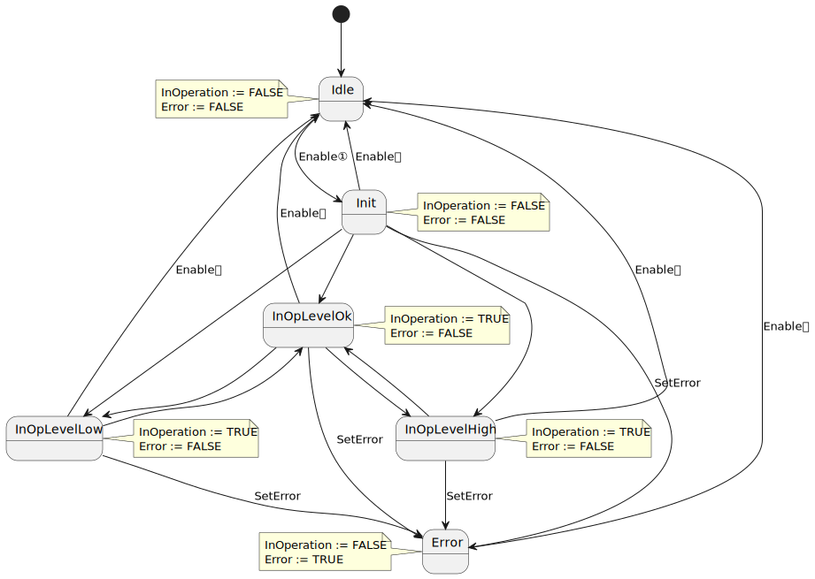

<h1 align="Left">
   
  
   
  HEI-Vs Engineering School - Industrial Automation Base
   
</h1>

Cours AutB

Author: [Cédric Lenoir](mailto:cedric.lenoir@hevs.ch)

# LAB 03 A complete function block for a sensor

In dieser Arbeit werden wir einen vollständigen Funktionsblock für einen Detektor bauen.

> In den meisten IDEs, einschließlich ctrlX PLC, besteht die Möglichkeit, Bibliotheken von Funktionen, Typen oder Funktionsblöcken zu erstellen. Wir diskutieren das Thema nicht.

Mit einem empirischen Programmiersystem könnten wir sagen, dass alles, was wir für einen Sensor benötigen, ein analoger oder digitaler Eingang ist, also letztendlich ein ``REAL`` oder ein ``BOOL``.

In der Praxis wird eine einfache Eingabe oder Ausgabe von einer Logik umgeben sein, die es ermöglicht, sie zu formatieren und zu validieren. Um zu vermeiden, dass für jeden Eingang und jeden Ausgang dieselbe Logik neu geschrieben wird, werden wir alles in einem Block kapseln. Der Funktionsblock.

# Sensor
Im Rahmen dieser praktischen Arbeit verwenden wir einen originalen Baumer-Lasersensor.

<figure>
    
    <figcaption>Baumer-O300DL-11199079</figcaption>
</figure>

> Dieser Sensor nutzt die **IO-Link-Technologie**, darauf kommen wir später in diesem Kurs zurück. Was Sie beachten müssen: Die Analog-Digital-Wandlung erfolgt nicht auf einer analogen Eingangskarte, sondern im Sensor.

## Technische Daten

|Titel |Werte|
|----------|------------- |
|Messabstand Sd |30 ... 250 mm|
|Strahlform |Punkt|
|Optische Ausrichtungsachse |< 2°|
|Spannungsbereich +Vs1) |11 ... 30 VDC
|Maximaler Verbrauch (keine Last) |30 mA|
|Restspannung Vd |< 2,5 VDC|
|Geschützt gegen Verpolung |ja|
|Geschützt gegen Kurzschlüsse |ja|
|Schnittstelle |IO-Link V1.1|
|Betriebstemperatur |-10 ... +60 °C|
|Schutzart |IP 67|

> Diese technischen Daten betreffen hauptsächlich die Person, die die Hardware verwaltet.

> Was uns bei der SPS-Programmierung interessiert, ist das bereitgestellte Datenformat.

## Synchrone Daten.
Als **synchrone** Daten werden Daten bezeichnet, die in mehr oder weniger festen Zeitabständen übertragen werden. Diese finden Sie in der Tabelle unten.

### IO-Link Processdata
|8-23|7|6|5|4|3|2|1|0|
|----|-|-|-|-|-|-|-|-|
|MDC1| | | | |A|Q| |BDC1|

**F**: Das Qualitätsbit, das anzeigt, dass die Signalqualität unter einem konfigurierten Schwellenwert liegt.

**BDC1**: Status des Sensorlogik-Schaltausgangs.

**A**: Das Alarmbit zeigt an, dass ein Problem mit der Sensorkonfiguration oder -funktionalität vorliegt.

**MDC1**: Kontinuierliche Messwerte vom Sensor.

> Wir werden mit diesen Daten arbeiten.

## Asynchrone Daten.
**Asynchrone** Daten sind solche, die das Auslesen der Eigenschaften des Sensors ermöglichen. Oder konfigurieren Sie es. Nachfolgend wird beispielhaft ein Teil der Parameter dargestellt.

Die [vordefinierten Parameter](#io-link-pre-definierte-parameter) werden zur Identifizierung des Sensors verwendet. Mit den [Binärkanalparametern](#io-link-binary-data-channels) können Sie einen Schwellenwert, beispielsweise eine Erkennung, direkt im Sensor verwalten.

### IO-Link Pre defined parameters
|Index      |Subindex (dec) |Access |Parameter name |Coding |Definition|
|-----------|---------------|-------|---------------|-------|----------|
|0x000C (12)| 0             |R/W    |Device Access Locks| Uint16|0: Unlocked (default)
|           |               |       |             |       |1: Device is operating properly|
|0x0010 (16)| 0             |R      |Vendor Name| String|Baumer Electric AG|
|0x0011 (17)| 0             |R      |Vendor Text| String|www.baumer.com|
|0x0012 (18)| 0             |R      |Device Name| String|Product Key External (<Product Key Internal>)|
|0x0013 (19)| 0             |R      |Product Id| String|Baumer Article Number|
|0x0014 (20)| 0             |R      |Device Text| String|Sensor specific|
|0x0015 (21)| 0             |R      |Serial Number| String|Production Order Nr / Serial Nr |
|0x0017 (23)| 0             |R      |Firmware Revision| String|Major.Minor ``##.##”|
|0x0018 (24)| 0             |R/W    |Application Specific Tag|String| Default: Filled with ******, as recommended by the IO-Link spec.|
|0x0024 (36)| 0             |R      |Device Status| Uint16| 0: Device is operating properly
|           |               |       |             |       | 1: Device is operating properly
|           |               |       |             |       | 2: Out-of-Specification
|           |               |       |             |       | 3: Functional-Check
|           |               |       |             |       | 4: Failure
|           |               |       |             |       | 5 - 255: Reserved|
|0x0025 (37)| 0             |R      |Detailed Device Status| Uint16| EventQualifier ``0x00” EventCode ``0x00, 0x00”

### IO-Link Binary Data Channels
|Index      |Subindex (dec) |Access |Parameter name| Coding| Definition|
|-----------|---------------|-------|---------------|-------|----------|
|0x003c (60)| 01            |R/W    | Setpoint SP1  |Uint16 |Teach Point [mm] (TP)|
|           | 02            |R/W    |Setpoint SP2   |Uint16 |Not supported|
|0x003d (61)| 01            |R/W    |Switchpoint logic|Uint8|0x00: not inverted 0x01: inverted|
|           | 02            |R/(W)  |Switchpoint mode|Uint8|Fixed value 0x01: Single point mode|

Die Verwaltung asynchroner Parameter kann direkt in der SPS erfolgen. Da die SPS jedoch auf zyklische Aufgaben ausgelegt ist, ist sie für diese Art von Arbeit ungeeignet. Es gibt beispielsweise bei Baumer eine Software, [Baumer Sensor Suite](https://www.baumer.com/us/en/products/baumer-sensor-suite/a/baumer-sensor-suite), die es Ihnen ermöglicht um die Sensoren direkt zu konfigurieren, ohne den Umweg über die SPS.

Die erwähnte Baumer BSS-Software ist jedoch mit einer Art IO-Link-Master verknüpft, dem Gerät, das als Gateway zwischen der IO-Link-Welt und der SPS dient.

<figure>
    
    <figcaption>IO-Link_Master_Profinet_8_Port_IP67</figcaption>
</figure>

Der Inhalt dieses Moduls ist Teil der Antwort auf das Problem der Konfiguration des Sensors aus der SPS heraus. Selbst wenn wir dies nicht tun, könnte die Entwicklung eines Funktionsblocks, selbst wenn er komplex ist, es dann ermöglichen, alle Sensoren einer Anlage zu konfigurieren und für zukünftige Anlagen wiederzuverwenden.

# Praktische Arbeit
Wir werden einen Funktionsblock programmieren, der synchrone Daten vom Sensor liest. Die Informationen werden dann formatiert und codiert, um die nützlichen Informationen direkt zu verwenden.

- Abstand, Datentyp: REAL, Einheit: mm
- Messfehler ErrorID-Code
- Schwellenwerte, oben, unten, Datentyp: REAL, Einheit: mm

## Funktionsblockbeschreibung

> Der Funktionsblock, der im PW_POU-Verzeichnis erstellt werden soll, *Rechtsklick auf Objekt hinzufügen...*
> Die im PW_DUT-Verzeichnis zu erstellenden Typen, *Rechtsklick auf Objekt hinzufügen...*

### Name
FB_O300_DL

### Input

|Name   |Type       |Description|
|-------|-----------|-----------|
|Enable	|BOOL	    |Activate Function Block, set data value in output if valid.|
|HighThreshold|REAL|Sets upper switching threshold|
|LowThreshold|REAL|Sets lower switching threshold|
|Other  |ANY        |[See below](#comportement-du-function-block)

### In Out
|Name   |Type       |Description|
|-------|-----------|-----------|
|hw |UA_O300_DL |In the particular context of the ctrlX to S7 interface.|

### Output
|Name         |Type         |Description         |
|-------------|:------------|--------------------|
|InOperation	|BOOL	        |Valid data at output|
|Value	|REAL	        |Distance from object in mm|
|Other  |ANY        |[See below](#comportement-du-function-block)
|Error	      |BOOL	        |There is an error   |
|ErrorID	    |WORD         |Some details about the error with Error Code.|

|ErrorID Code |Description|
|-------------|-----------|
|16#0000      |Data valid |
|16#0001      |Quality bit, signal is below the configured threshold.|
|16#0002      |Alarm bit, signal an error in sensor, this alarm has priority over ID 16#0001|
|16#0003      |Id not defined|

# Verhalten des Funktionsblocks

### Modell in Betriebsbasis
Es gibt einige Grundmodelle von Funktionsblöcken, insbesondere ein sogenanntes *In Operation Base*-Verhalten. Ein typisches Beispiel für diesen Blocktyp ist die Überwachung eines Sensors. Es bleibt aktiv, solange der ``Enable``-Eintrag ``TRUE`` ist. Im Gegensatz dazu steht ein Block vom Typ ``Execute``, der eine einzelne, zeitlich begrenzte Aktion auslöst.

Das Zustandsdiagramm eines Funktionsblocks vom Typ ``Enable In Operation`` sieht wie im folgenden Diagramm aus:

<figure>
    
    <figcaption>Function Block Enable In Operation Base</figcaption>
</figure>

In dem für uns interessanten Fall wollen wir zwei zusätzliche Informationen erhalten, die direkt von der Zustandsmaschine abhängig sind.
### Output
|Name         |Type         |Description         |
|-------------|:------------|--------------------|
|HighLimit	  |BOOL	        |Valid signal above HighThreshold|
|LowLimit	  |BOOL	        |Valid signal above LowThreshold |

Wir könnten es so darstellen:
<figure>
    
    <figcaption>Function Block Enable In Operation Base with Sub States</figcaption>
</figure>

Theoretisch wäre es möglich, direkt von ``LevelLow`` zu ``LevelHigh`` zu wechseln, dies fügt jedoch nichts zum allgemeinen Betrieb hinzu und erfordert zusätzliche Übergänge.
Andererseits könnte sich diese Form als etwas komplexer zu programmieren erweisen, ich persönlich verwende sie kaum. Ich bevorzuge es, das vollständige Formular zu codieren.

<figure>
    
    <figcaption>Function Block Enable In Operation Base with More States</figcaption>
</figure>

Wir sehen schnell, dass selbst wenn die Anzahl der Zustände begrenzt ist, die vollständige Darstellung schnell schwer zu entschlüsseln ist.

### Abschluss
Verwenden Sie das zusammengesetzte Zustandsdiagramm, auch wenn es sich um die Codierung einfacher Zustände handelt.

### Bei Problemen beenden
Abhängig von der Verwendung des Sensors kann ein falscher Messwert zu Problemen führen.

Wenn in diesem Beispiel die Signalqualität nicht korrekt ist oder wir nicht erkannt werden, **möchten wir definitiv keinen Wert von 0**.

Wir fügen einen ``DefaultOut``-Eintrag hinzu, der es Ihnen ermöglicht, eine Standardausgabe zu definieren. Wir werden das System mit einem Standardwert von 251 testen, was einen mm mehr als der theoretische Messbereich des Sensors ist.

# Schritt für Schritt

Im FB müssen Sie:

- Konvertieren Sie die Eingabegröße ``hw.Value`` in eine temporäre Variable,
- Erstellen Sie eine Enum ``E_OperationBaseDL``.
- Erstellen Sie eine Statusvariable ``eOperationBaseDL``, um die ``Enum`` zu verwenden.
- Schreiben Sie eine ``CASE...OF``-Zustandsmaschine mit den verschiedenen Zuständen und Übergangsbedingungen.
- Definieren Sie die Ausgänge ``InOperation``, ``HighLimit``, ``LowLimit`` und ``Error``, die nur von den Zuständen abhängen.
- Definieren Sie die Variable ``ErrorId`` mit den Bedingungen ``IF..ELSIF..ELSE``.
- Wert mit ``IF..ELSE`` basierend auf InOperation zulassen.

Der ``FB`` wird in ``PLC_PRG`` verwendet und getestet, Einträge wie ``Enable`` werden manuell erzwungen.

# Prüfen
- Verwenden Sie Prosys OPC UA Monitor, um das Sensorverhalten zu testen.
- Bewegen Sie mit dem Roboter die Z-Achse vor dem Sensor und dann die Y-Achse, um den Abstand der Z-Achse vom Sensor zu variieren.
> Verwenden Sie fbO300_DL in PLC_PRG, um Ihren FB zu testen.

<figure>
    
    <figcaption>Use Kinematic For Test, 192.168.0.200</figcaption>
</figure>

<figure>
    
    <figcaption>Example of HMI Test Screen</figcaption>
</figure>

# Über die IO-Link-Website
[Site internet général IO-Link](https://io-link.com)

[IODD Finder](https://ioddfinder.io-link.com/#/)

[Codage IO-Link on PLCopen, IEC61131-9](https://plcopen.org/iec-61131-9)

## SetPoint
Wir werden die **Switchpoint-Logik** umkehren.
Die Idee besteht darin, die Y-Achse des Roboters zu nutzen.
Unterschreitet der Abstand einen bestimmten Schwellenwert, wird ein Alarm ausgelöst.

<figure>
    
    <figcaption>Invert Switch Point Zero Below 160</figcaption>
</figure>

## Abschluss
Sie können entweder einen FB programmieren oder die Sensorwerte verwenden.

Wir können auch verstehen, dass die Arbeitszeit für einen einfachen Sensor nicht vernachlässigbar ist. Dies zeigt, wie interessant es ist, einmal einen robusten FB zu schreiben, der dann in mehreren Projekten wiederverwendet werden kann.